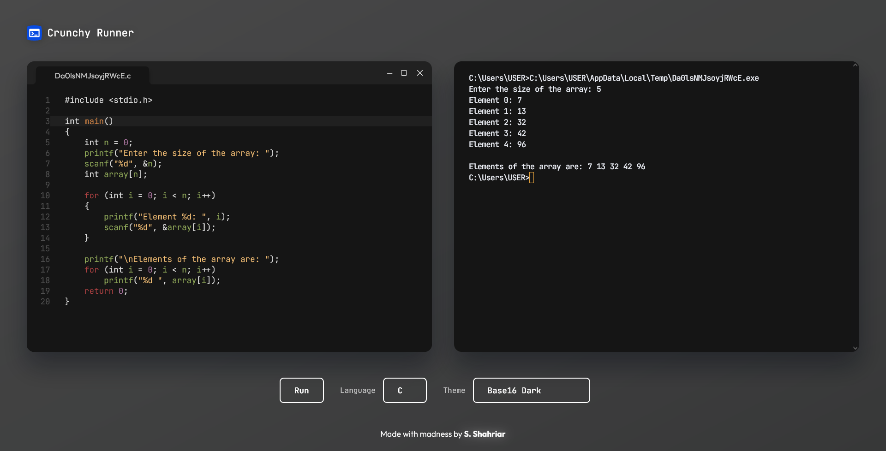

# Crunchy Runner

## Overview

> **Crunchy Runner** is a local compiler and code runner created with web technologies. It uses [`node-pty`][1] to create a terminal instance that users can interact with in the front end using [`xterm.js`][2]

**Update:** Added support for **C#**, **Java**, **Python**, and **JavaScript**.

[📌 **Video Demo**][8]



This project was _heavily_ inspired by the [**Programiz Online C Compiler**][3], but it lacked themes and customizability. So, I decided to create something similar with more features.

Initially, it started as a weekend project where I learned how to connect the backend with the frontend using [`express.js`][4] and [**web sockets**][5].

Special thanks to [**Ehsanul Haque**][11] vaiya for this project idea. I had a great time brainstorming this one.

## Prerequisites

This project depends on `node-pty`, which in turn depends on an older version of Node.js (**<v18**). If you are using a newer version of Node.js (**≥v18**), it is recommended to use [**Node Version Manager (nvm)**][6] to switch to the older version. In my case, Node **v17.9.1** seems to work well with `node-pty`.

If you are on Windows, you might need to install some [**additional tools**][7] first. Specifically these ones:

-   **Python**
    -   [Python 2.7.15 (x64)][15]
-   **Visual Studio Installer**
    -   [Windows SDK 10.0.22621.3233][13]
    -   [Microsoft VS2015U3 VC++ 2015 x64 Spectre Libs][14]

## Installation

Assuming you have the appropriate version of [**Node.js**][12] installed, run the following command to install the dependencies:

```bash
npm install
```

After that, run the following to see the project in action:

```bash
npm start
```

## Features

-   Minimal Design
-   **10+** Dark Themes
-   Support for multiple languages (C, C++, C#, Java, Python, JavaScript)
-   Code Editor powered by [**CodeMirror**][9]
-   Real-time terminal emulation (I/O) using [`node-pty`][1] and [`xterm.js`][2]

## Compilers

IDEs like [**Code::Blocks**][21] come with bundled compilers for C-like languages. However, **Crunchy Runner** uses local compilers that are already installed on your system. So, you must install the compilers **manually** if your system doesn't have them.

| Language   | Software                                         | Instructions                  |
| ---------- | ------------------------------------------------ | ----------------------------- |
| C, C++     | GNU&nbsp;Compiler&nbsp;Collection&nbsp;(**GCC**) | [**MSYS2**][16]               |
| C#         | C#&nbsp;Compiler&nbsp;(**CSC**)                  | [**Stack&nbsp;Overflow**][17] |
| Java       | Java&nbsp;Development&nbsp;Kit (**JDK**)         | [**Official&nbsp;Site**][18]  |
| Python     | Python                                           | [**Official&nbsp;Site**][19]  |
| JavaScript | Node.js                                          | [**Official&nbsp;Site**][20]  |

## License

The source code is licensed under [**MIT**][10].

<!-- === links === -->

[1]: https://www.npmjs.com/package/node-pty
[2]: https://xtermjs.org/
[3]: https://www.programiz.com/c-programming/online-compiler/
[4]: https://expressjs.com/
[5]: https://www.npmjs.com/package/ws
[6]: https://github.com/coreybutler/nvm-windows/releases/tag/1.1.12
[7]: https://github.com/microsoft/node-pty#windows
[8]: https://youtu.be/MHisDMl7HQI
[9]: https://codemirror.net/
[10]: ./LICENSE
[11]: https://www.facebook.com/61556343740668/
[12]: https://nodejs.org/en/blog/release/v17.9.1
[13]: https://developer.microsoft.com/en-us/windows/downloads/windows-sdk/
[14]: https://aka.ms/vs/14/release/vcpp_spectre_libs_x64
[15]: https://www.python.org/downloads/release/python-2715/
[16]: https://www.msys2.org/
[17]: https://stackoverflow.com/a/47624225
[18]: https://www.oracle.com/java/technologies/downloads/
[19]: https://www.python.org/downloads/
[20]: https://nodejs.org/en/download/package-manager
[21]: https://www.codeblocks.org/
